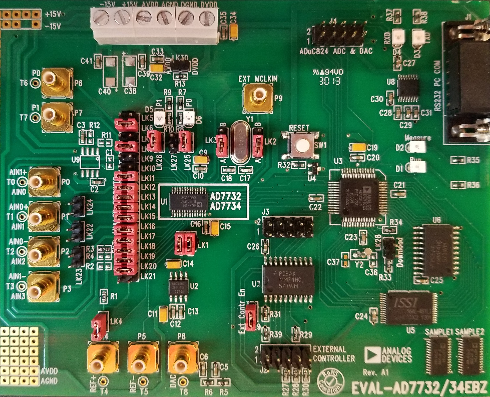
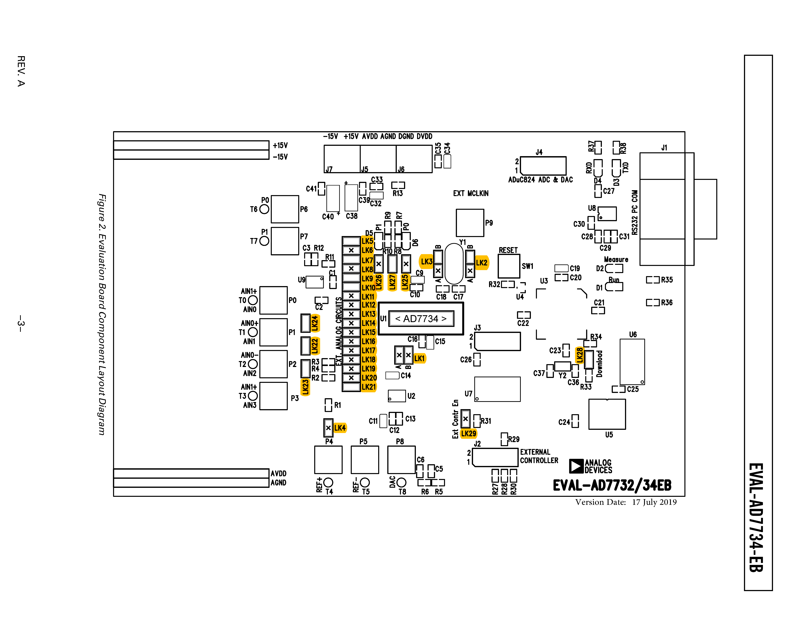

# AD7734Lib

Arduino library for controlling the *[ADC: AD7734]* chipset using SPI protocol

## **Evaluation Board**: *[EVAL-AD7734EB]*

### Link Pin Configuration

   | Link | Connection [Default] | Description[1](#Inline-Notes)                                 |
   | ---- | :------------------: | ------------------------------------------------------ |
   | LK1  |         A/B          | A: REFIN(+) Source: AVDD   B: REFIN(-) Source: AGND |
   | LK2  |          A           | MCLKIN  (A for integrated clock)                       |
   | LK3  |          A           | MCLKOUT (A for integrated clock)                       |
   | LK4  |       Inserted       | REF(+) → BIAS [LK11, 14, 15, 18, 20, 24(22)]           |
   | LK5  |       Removed        | AVDD ↔ AVDD                                            |
   | LK6  |       Inserted       | P6   → U17 P0                               |
   | LK7  |       Removed        | AGND ↔ AGND                                            |
   | LK8  |       Inserted       | P7   → U18 SYNC/P1                          |
   | LK9  |       Removed        | [ ]  → U19 INTBIAS                          |
   | LK10 |       Removed        | [ ]  → U110 MUX0                            |
   | LK11 |       Inserted       | BIAS → U111 BIAS0                           |
   | LK12 |       Inserted       | P0   → U112 AINO                            |
   | LK13 |       Inserted       | P1   → U113 AIN1                            |
   | LK14 |       Inserted       | BIAS → U114 BIAS1                           |
   | LK15 |       Inserted       | BIAS → U115 BIAS2                           |
   | LK16 |       Inserted       | P2   → U116 AIN2                            |
   | LK17 |       Inserted       | P3   → U117 AIN3                            |
   | LK18 |       Inserted       | BIAS → U118 BIAS3                           |
   | LK19 |       Inserted       | AGND → R3 → U119 BIASLO                     |
   | LK20 |       Inserted       | BIA  → R1 → U120 BIASHI                     |
   | LK21 |       Removed        | AGND ↔ AGND                                            |
   | LK22 |       Removed        | TEST SHORT: P1 ↔ P2                                    |
   | LK23 |       Removed        | TEST GND: P2(P1) → AGND                         |
   | LK24 |       Removed        | TEST BIAS:  P1(P2) → BIAS                             |
   | LK25 |       Inserted       | AVDD → R7 + ( R8 \| D6) → U17 P0            |
   | LK26 |       Inserted       | AVDD → R9 + (R10 \| D5) → U17 SYNC/P1       |
   | LK27 |       Removed        | TRIG → R13 → U17 P0                         |
   | LK28 |       Removed        | PSEN → DGRN: DownLoad                                 |
   | LK29 |       Inserted       | EXT  → DRGN: Enable External Controller               |
   | LK30 |       Removed        | AVDD ↔ DVDD Connector (not listed in documentation)    |

 Updated: 17 July 2019 

[ADC: AD7734]: https://www.analog.com/media/en/technical-documentation/data-sheets/AD7734.pdf
[EVAL-AD7734EB]: ./docs/EVAL-AD7734EB_revA.pdf

###### Inline Notes

1. Pin Description is best guess from documentation & wiring schematic. Defaults are unknown. U1 socket is populated with the AD7734 Chipset."
